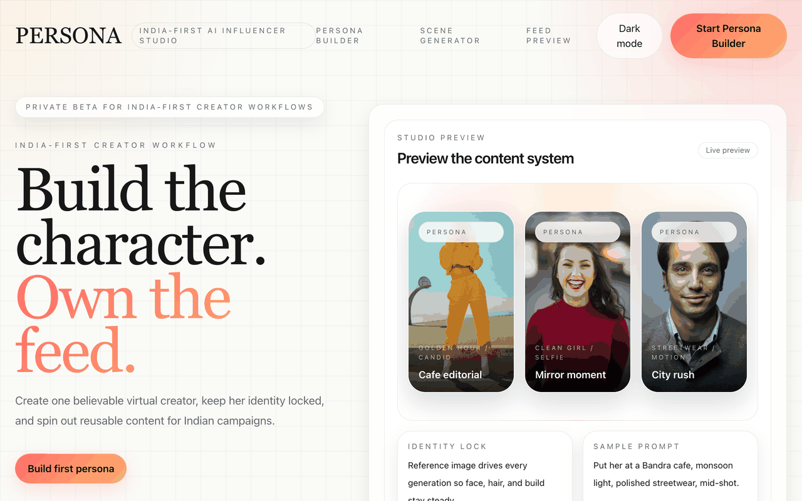

<div align="center">

# tanker

### A Claude Code framework that ships **deployed products** from a one-line brief.

[](https://opensource.org/licenses/MIT)
[](https://github.com/tanishg98/tanker/stargazers)
[](https://docs.claude.com/claude-code)
[](https://github.com/tanishg98/tanker/pulls)

[**Quick start →**](#install) · [**Examples →**](./examples/) · [**vs MetaGPT →**](./docs/comparisons/metagpt.md)

</div>

---

<div align="center">



### Built with Tanker · live in production

**[persona-studio-lime.vercel.app](https://persona-studio-lime.vercel.app)** — India-first AI influencer studio. One `/cto` brief. One weekend. Deployed.

</div>

---

## Try it

```bash
bash <(curl -fsSL https://raw.githubusercontent.com/tanishg98/tanker/main/install.sh)
/vault-add github vercel supabase anthropic
/cto "AI business analyst for Indian D2C sellers — chat with your data"
```

~30 minutes of attention later, you have:

- ✅ Live production URL
- ✅ Repo with branch protection, CI, versioned migrations
- ✅ Provisioned Vercel + Railway + Supabase + GitHub
- ✅ Sentry + analytics + uptime wired
- ✅ Full audit trail in `outputs/<slug>/messages.jsonl`

→ [Detailed install guide](./docs/getting-started/install.md)

---

## What makes Tanker different

> Most autopilots either **go fully autonomous** (and ship slop) or **stop everywhere** (and waste your time).
> Tanker stops twice — at PRD, at MVP — but only after a review agent has pre-qualified the work.
> You see only what's worth seeing.

| | |
|---|---|
| 🎯 **Two human gates pre-qualified by review agents** | Best of both autopilot worlds. ~30 min of owner attention per `/cto` run. |
| 🏗️ **Real infrastructure provisioning** | GitHub repo + Supabase project + Vercel project + Railway service. Created via APIs from a 0600-perms vault. Most "AI build" tools end at a code repo. Tanker ends at a deployed URL. |
| ⏯️ **Resumable across sessions** | State checkpointed every phase. `messages.jsonl` is the typed audit trail. `/cto --resume <slug>` picks up where you left off. |
| 🧠 **Local semantic retrieval** | Tanker indexes your Obsidian vault + curated GitHub references into local ChromaDB. Phase 1 retrieves from your knowledge — not generic GitHub search. |
| 🛡️ **Opinionated quality rails** | Always-on rules: Boil the Lake, Search Before Building, No AI Slop (with explicit ban list), Safety Before Speed, Skill Chaining. |
| 💰 **Cost ceiling built in** | `--max-cost-usd` (default $10). Tracks spend per Message envelope. Warns at 70%, halts at 100%. No surprise bills. |

→ [Architecture overview](./docs/architecture/overview.md)

---

## The `/cto` pipeline

```
intake → context (parallel: brain, refs) → reference (github-scout)
  → /grill → /benchmark? → /prd → prd-reviewer → 🛑 GATE 1 (human review)
  → /architect → /createplan → /advisor (cross-model peer review)
  → PROVISION (parallel: gh + supabase + vercel + railway)
  → BUILD (parallel: frontend + backend + data + content engineers)
  → /pre-merge + /autoresearch-review per PR (bounded retry, max 2)
  → mvp-reviewer → 🛑 GATE 2 (human review)
  → /deploy → /monitor → final report
```

→ [How `/cto` works](./docs/getting-started/first-cto.md)

---

## What's inside

<table>
<tr>
<td valign="top" width="33%">

### **34 Skills**

Slash commands that do the work.

**Think** — `/grill` `/benchmark` `/prd`
**Design** — `/architect` `/ui-hunt` `/design-shotgun`
**Plan** — `/createplan` `/advisor`
**Build** — `/execute` `/backend-builder` `/browser-extension-builder` `/mobile-app-builder`
**Data** — `/analyst` (ReAct sandbox)
**Ship** — `/ship` `/deploy` `/monitor`
**Quality** — `/autoresearch-review` `/security-review` `/test-gen` `/debug`
**Memory** — `/learn` `/retro` `/context-save` `/context-restore`

→ [Full skill index](./docs/skills/index.md)

</td>
<td valign="top" width="33%">

### **9 Agents**

Specialists in isolated context.

**Review (read-only)**
`explore` `pre-merge` `prd-reviewer` `mvp-reviewer` `site-eval` `review`

**Research**
`github-scout`

**Provisioner (scoped write)**
`gh-provisioner`
`supabase-provisioner`
`vercel-provisioner`
`railway-provisioner`

→ [Agent details](./docs/agents/index.md)

</td>
<td valign="top" width="33%">

### **3 Always-on rules**

Loaded every session.

**`builder-ethos`** — Six principles. Boil-the-Lake, Search-Before-Building, Fix-First-Review, No-AI-Slop, Safety-Before-Speed, Skill-Chaining.

**`code-standards`** — Type discipline, comment-the-why, pattern consistency.

**`static-site-standards`** — Single-file-first, no frameworks, IntersectionObserver animations, eval gate.

→ [Rules](./docs/rules/builder-ethos.md)

</td>
</tr>
</table>

---

## Examples

| Example | What it shows |
|---|---|
| [**SaaS MVP**](./examples/saas-mvp/) — *Persona Studio* | `/cto` end-to-end: brief → deployed product with auth + DB + UI |
| [Static site](./examples/static-site/) | `/static-site-replicator` + `/design-shotgun` flow |
| [Browser extension](./examples/browser-extension/) | Chrome MV3 with content scripts + storage |
| [Bug fix](./examples/bug-fix/) | `/explore` → `/debug` → `/test-gen` → `/ship` on existing repo |
| [Data analysis](./examples/data-analysis/) | `/analyst` ReAct loop on a real dataset |

---

## How it compares

Honest, non-defensive comparisons in the docs:

- [**Tanker vs MetaGPT**](./docs/comparisons/metagpt.md) — most-asked. Tanker borrows MetaGPT's typed Message schema, SOP triplet pattern, bounded retry loop. Disagrees with their full-autonomy default.
- [Tanker vs AutoGen](./docs/comparisons/autogen.md)
- [Tanker vs CrewAI](./docs/comparisons/crewai.md)
- [Tanker vs Aider](./docs/comparisons/aider.md) — complementary, not competing
- [Tanker vs gstack](./docs/comparisons/gstack.md) — same primitives, different opinions

---

## Repo structure

```
.claude/
├── agents/      — 9 specialist agents
├── rules/       — 3 always-on operating principles
├── schemas/     — JSON schemas for validated artifacts
└── skills/      — 34 slash commands

docs/            — mkdocs site
examples/        — five worked examples (SaaS MVP is real, deployed)
outputs/         — runs go here (one folder per slug)

install.sh       — one-line installer
mkdocs.yml       — docs config
```

---

## Contribute

PRs welcome. Bar:

- **New skills** — SOP triplet (Constraints / Reference / Output Format), JSON sidecar schema, worked example
- **New agents** — structured JSON output validated against a schema in `.claude/schemas/`
- **New rules** — argued in PR description with concrete examples of the failure mode it prevents

Run `mkdocs build --strict` before opening a docs PR.

---

## License

MIT · Built by [**Tanish Girotra**](https://github.com/tanishg98) — head of product, Shiprocket India.

If you ship something with Tanker, [open an issue](https://github.com/tanishg98/tanker/issues/new) and link it. The `examples/` directory is community-grown.

<div align="center">

⭐ **Star the repo** if Tanker shapes how you build with Claude.

</div>
